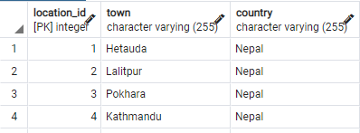
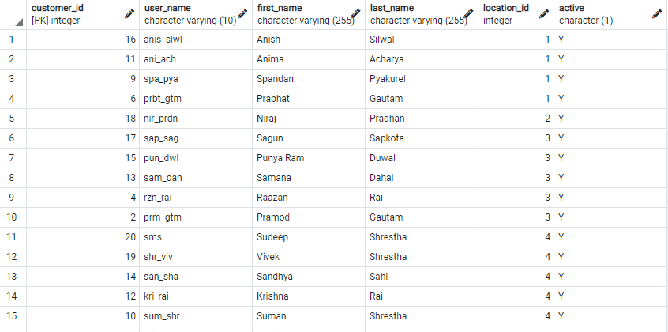
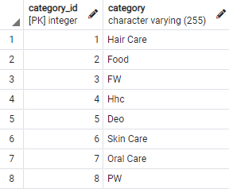
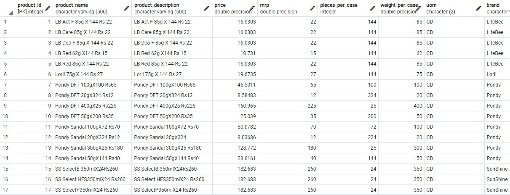
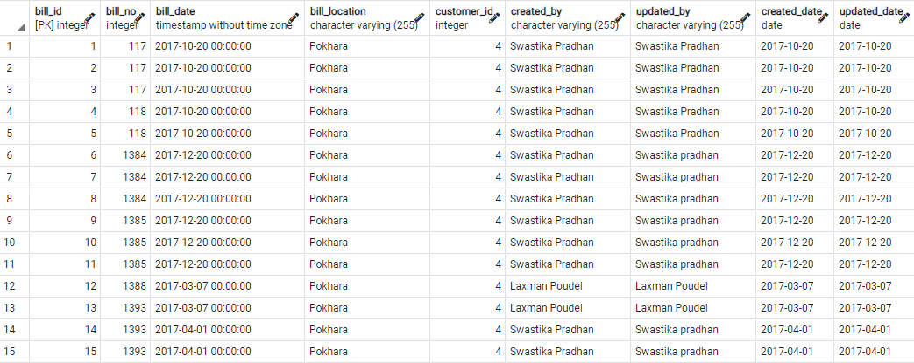
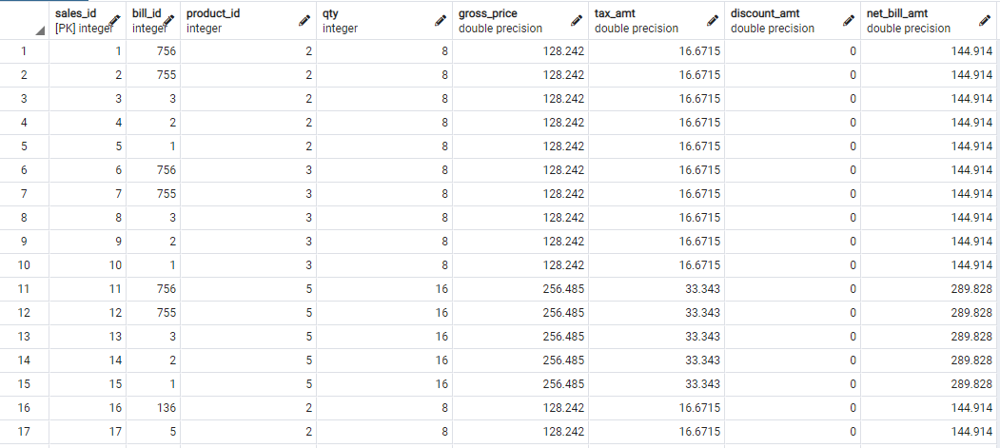

# ETL Process
## Extraction
The following are the steps involved in extraction:
- A database ecommerce_db is created.
- Three raw tables are created as raw_customer, raw_product, and raw_sales.
- The data types for all the attributes in all tables are given as VARCHAR(255) for the time being as some of the data must be transformed in the format of a data type.
- No constraints are given on either of the tables.
- Extract the data from the dump files into raw database tables.
- The raw data tables are archived into 3 archive tables.

## Transaction
Steps involved in the transformation:
- Transform raw data to a standard customer, staff, product, bill, and sales table.
- In customer table,
  - Format the country as a title case using INITCAP.
  - Remove the _ from the last_name data of the customer.
- In the product table,
  - Apply title case to the category names.
  - Apply uppercase on the category names having length 2.
  - Extract the date from created_date and updated_date.
- In the bill table,
  - Format the date from bill_date, created_date, and updated_date as a TIME.
  - Add values to the null data in the updated_by column with the corresponding value in the created_by column.
  - Apply title case to the created_by and updated_by columns.
  - Add values to the null data in the updated_date column with the corresponding value in the created_date column.

## Load
# dim_location
Steps
- Empty the dim_location dimension table
- Get the distinct town from standard customer table along with the country name.
- Insert the new data in the dim_location dimension table.

# dim_customer
Steps
- Empty the dim_customer dimension table
- Get the all the data from standard customer table; however, map the town and country with the dim_location dimension table.
- Insert the new data in the dim_customer dimension table.

# dim_category
Steps
- Empty the dim_category dimension table
- Get the distinct category from standard product table.
- Insert the new data in the dim_category dimension table.

# dim_product
Steps
- Empty the dim_product dimension table
- Get the all the data from standard product table; however, map the categoryy with the dim_category dimension table.
- Insert the new data in the dim_product dimension table.

# dim_bill
Steps
- Empty the dim_bill dimension table
- Get the bill details from the standard bill table.
- Insert the new data in the dim_bill dimension table.

# fact_sales
Steps
- Empty the fact_sales fact table
- Get the all the data from standard sales table.
- Insert the new data in the fact_sales fact table.

