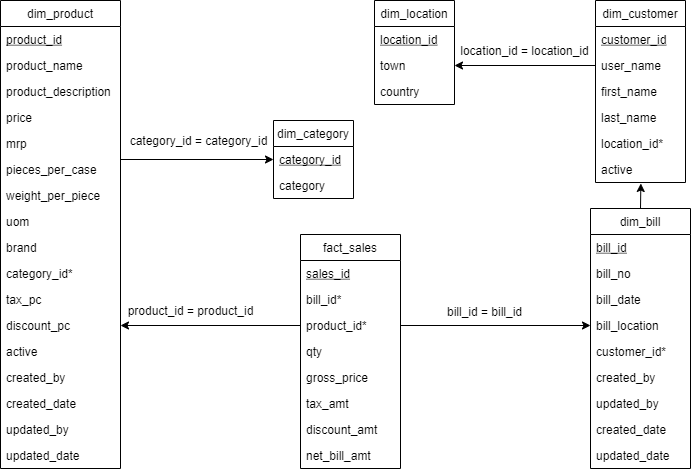

# Data Warehouse Design for an eCommerce site
## Business Requirements
The following are the business requirements of the system:
- The business domain is eCommerce.
- Analyze sales data to improve sales and find out trends among customers.
- Analyze sales data to invest more in products that are
  - Selling fast
  - Producing high profits
- Identify the products that are not doing well.

## Potential Area of Analysis
The following are the potential area of analysis:
- Identify the popular products among customers.
- Identify the least selling products.
- Analyze the customers based on their locations.
- Analyze the products based on their category.
- Analyze the products sold to customers.
- Analyze sales for a specific day.

## Possible Dimensions
The following are the possible dimensions:
- **dim_location** (*location_id*, town, country)
- **dim_customer** (*customer_id*, user_name, first_name, last_name, location_id*, active)
- **dim_category** (*category_id*, category)
- **dim_product** (*product_id*, product_name, product_description, price, mrp, pieces_per_case, weight_per_piece, uom, brand, category_id*, tax_percent, discount_pc, active, created_by, created_date, updated_by, updated_date)
- **dim_bill** (*bill_id*, bill_no, bill_date, bill_location, customer_id*, created_by, updated_by, created_date, updated_date)
- **fact_sales** (*sales_id*, bill_id*, product_id*, qty, gross_price, tax_amt, discount_amt, net_bill_amt)

## Possible Facts
The following are the possible facts:
- Product sales quantity
- Gross price for sales product
- Tax amount for a sold product
- The discount amount for a product
- Net bill amount for a sales product

## Logical Model

[Link to the diagram](https://app.diagrams.net/#G1fz_FY-AXQpEv9yNQhccgYX-JzqJFtR_9)
